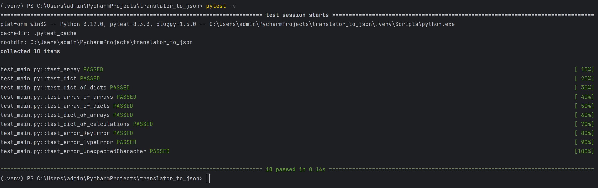

# Описание

Этот проект представляет собой инструмент командной строки для перобразования текста из 
входного формата (учебный конфигурационный язык) в выходной (JSON)

# Установка

Для начала, убедитесь, что у вас установлен Python. Затем выполните следующие шаги:
1. Установка программы и переход в директорию
2. ```bash
   git clone <URL репозитория>
   cd <директория проекта>
   ```
2. Создайте и активируйте виртуальное окружение:
   ```bash
   python3 -m venv venv
   source venv/bin/activate  # Для Linux/Mac
   venv\Scripts\activate     # Для Windows
   ```
3. Установите необходимые зависимости (pytest для тестов):
   ```bash
   pip install pytest
   ```

# Запуск скрипта

Скрипт принимает текст конфигурационного файла через стандартный ввод и выводит JSON в стандартный вывод.

Пример запуска:
```bash
 cat edu_lang.SENYA | python main.py > output.json
```
Здесь:
- **edu_lang.SENYA** — файл с конфигурационными данными на учебном языке.
- **output.json** — файл, в который будет записан результат в формате JSON.

Также можно запустить скрипт с вводом данных напрямую через консоль:
```bash
python script.py
```
После этого вы можете ввести конфигурацию вручную. Для завершения ввода нажмите ```Ctrl+D``` (Linux/macOS) или ```Ctrl+Z``` (Windows).
# Примеры входных и выходных данных

### Пример 1: Математические данные
**Входные данные:**
```
global pi = 3.14
global radius = 5
global a = 10
global b = 8
global circle = begin
radius:=radius;
perimeter:=@[* @[* pi radius] 2];
square:=@[* pi @[pow() radius 2]]
end
global rect = begin
a:=a;
b:=b;
perimeter:=@[* 2 @[+a b]];
square:=@[* a b]
end
```
**Выходные данные (JSON):**
```json
{
    "pi": 3.14,
    "radius": 5.0,
    "a": 10.0,
    "b": 8.0,
    "circle": {
        "radius": 5.0,
        "perimeter": 31.4,
        "square": 78.5
    },
    "rect": {
        "a": 10.0,
        "b": 8.0,
        "perimeter": 36.0,
        "square": 80.0
    }
}
```


### Пример 2: Данные о студентах
**Входные данные:**
```
global group = 10
global idkrasotkin = 15
global idzhaglo = 7
global idkorotkov = 14
global idlyaskovskiy = 20
global idzapryagaev = 9
global students = begin
   zapryagaev:=begin id:=idzapryagaev; marks:=#(5 5 5 5 5 5) end;
   zhaglo:=begin id:=idzhaglo; marks:=#(5 5 5 5 5 4) end;
   krasotkin:=begin id:=idkrasotkin; marks:=#(5 5 5 5 5 5) end;
   lyaskovskiy:=begin id:=idlyaskovskiy; marks:=#(5 5 5 5 5 5) end;
   korotkov:=begin id:=idkorotkov; marks:=#(5 5 5 5 5 5) end
enы
```
**Выходные данные (JSON):**
```json
{
    "group": 10.0,
    "idkrasotkin": 15.0,
    "idzhaglo": 7.0,
    "idkorotkov": 14.0,
    "idlyaskovskiy": 20.0,
    "idzapryagaev": 9.0,
    "students": {
        "zapryagaev": {
            "id": 9.0,
            "marks": [
                5.0,
                5.0,
                5.0,
                5.0,
                5.0,
                5.0
            ]
        },
        "zhaglo": {
            "id": 7.0,
            "marks": [
                5.0,
                5.0,
                5.0,
                5.0,
                5.0,
                4.0
            ]
        },
        "krasotkin": {
            "id": 15.0,
            "marks": [
                5.0,
                5.0,
                5.0,
                5.0,
                5.0,
                5.0
            ]
        },
        "lyaskovskiy": {
            "id": 20.0,
            "marks": [
                5.0,
                5.0,
                5.0,
                5.0,
                5.0,
                5.0
            ]
        },
        "korotkov": {
            "id": 14.0,
            "marks": [
                5.0,
                5.0,
                5.0,
                5.0,
                5.0,
                5.0
            ]
        }
    }
}
```

### Пример 3: Результаты анализов
**Входные данные:**
```
global pacient = 1234
global results = begin
    hemoglobin:=14.2;
    redbloodcells:=5.2;
    whitebloodcells:=7.8;
    platelets:=250;
    hematocrit:=42.5;
    glucose:=95;
    cholesterol:=200
    end
global analysis=begin
id:=pacient;
results:=results
end
```
**Выходные данные (JSON):**
```json
{
    "pacient": 1234.0,
    "results": {
        "hemoglobin": 14.2,
        "redbloodcells": 5.2,
        "whitebloodcells": 7.8,
        "platelets": 250.0,
        "hematocrit": 42.5,
        "glucose": 95.0,
        "cholesterol": 200.0
    },
    "analysis": {
        "id": 1234.0,
        "results": {
            "hemoglobin": 14.2,
            "redbloodcells": 5.2,
            "whitebloodcells": 7.8,
            "platelets": 250.0,
            "hematocrit": 42.5,
            "glucose": 95.0,
            "cholesterol": 200.0
        }
    }
}
```

# Тесты

Шаги запуска тестов:
1. Установить библиотеку pytest (необходимо, если не сделано ранее):
   ```bash
   pip install pytest
   ```
   
2. Для запуска тестирования необходимо запустить следующий скрипт:
   ```shell
   pytest -v
   ```

## Прохождение тестов:
